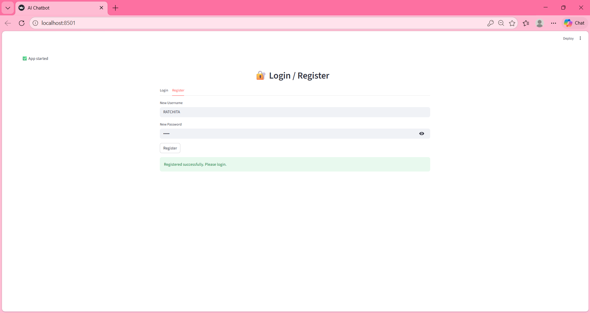
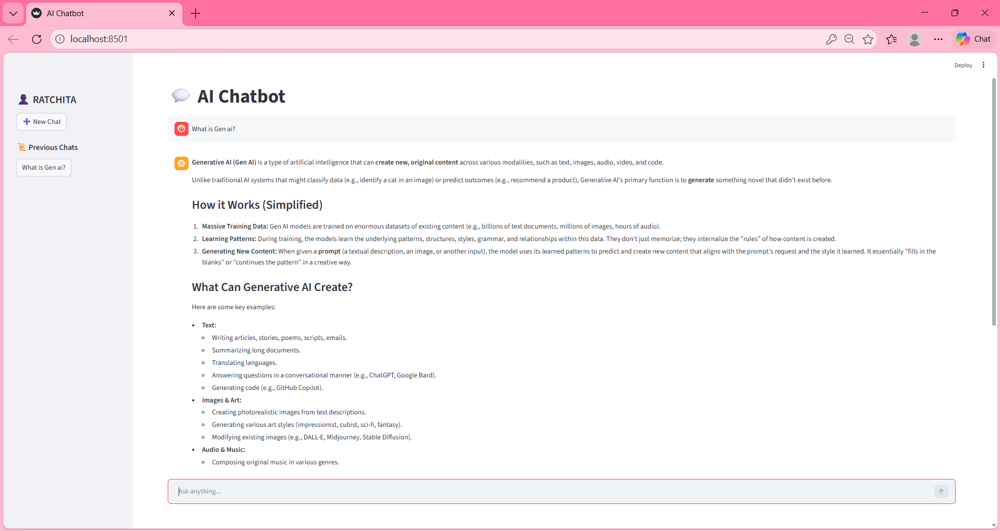
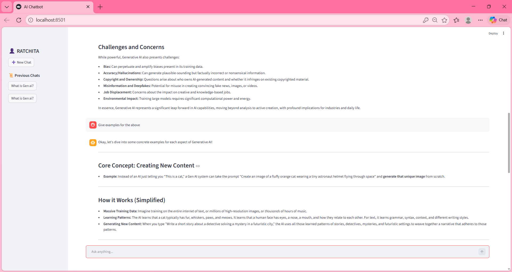

---


---

# 🚀 NeuroGraph – Memory AI Chatbot

> 🧠 A **LangGraph-powered AI Chatbot** with **persistent memory, authentication system, and multi-session chat history**, built using **Streamlit + Gemini 2.5 Flash**

---

## 🧠 Overview

**NeuroGraph Memory Chatbot** is an advanced AI system that:

* 🤖 Generates intelligent responses using **Gemini 2.5 Flash**
* 🧠 Remembers past conversations (chat memory)
* 🔐 Supports **Login / Register authentication**
* 📜 Stores multiple chat sessions per user
* ⚡ Uses **LangGraph agent-based workflow**

It mimics a **real-world AI assistant with memory + user sessions**.

---

## ⚙️ Architecture (LangGraph Flow)

```
User Input
   ↓
LangGraph Workflow
   ↓
Agent Node (LLM - Gemini)
   ↓
Memory Handler (SQLite)
   ↓
Response Output
```

---

## ✨ Features

### 🤖 AI Chatbot

* Powered by **Gemini 2.5 Flash**
* Structured + accurate responses
* Handles general queries, concepts, coding, etc.

---

### 🧠 Memory System

* Stores chat history using **SQLite**
* Context-aware responses
* Multi-session chat support

---

### 🔐 Authentication System

* User **Login / Register**
* Secure password storage using **bcrypt**
* User-specific chat history

---

### 📜 Chat History Sidebar

* View previous chats
* Chat titles auto-generated
* Click to resume conversations

---

### ⚡ LangGraph Integration

* Graph-based execution flow
* Modular agent design
* Scalable architecture

---

## 🧠 LangGraph Components Used

### 🔹 Agents

* LLM Agent (Gemini Response Generator)

---

### 🔹 Tools

* Calculator Tool (basic eval-based)
* Search Tool (mock response handler)

---

### 🔹 Graph Flow

* Input → Agent → Output  
* Memory handled externally (SQLite)

---

## 📸 Screenshots

### 🏠 Register Screen


### 💬 Chat Interaction


### 🧠 Memory (Context Awareness)


---

## 🧠 Tech Stack

| Technology      | Purpose             |
|---------------- |---------------------|
| Streamlit       | Frontend UI         |
| LangGraph       | Agent workflow      |
| Gemini API      | LLM                 |
| SQLite          | Database (memory)   |
| Python          | Backend logic       |
| bcrypt          | Authentication      |

---

## 📁 Project Structure

```bash
neurograph-memory-chatbot/
│
├── app.py
│
├── auth/
│   ├── auth.py
│   ├── db.py
│
├── chatbot/
│   ├── agent.py
│   ├── graph.py
│   ├── memory.py
│   ├── tools.py
│
├── utils/
│   ├── helpers.py
│
├── data/
│
├── assets/
├── .streamlit/
│   └── secrets.toml
│
├── .env
├── .gitignore
├── requirements.txt
├── README.md
├── LICENSE
```

---

## ⚙️ Installation

### 1️⃣ Clone Repository
```bash
git clone https://github.com/22AD040/neurograph-memory-chatbot.git
cd neurograph-memory-chatbot
```

### 2️⃣ Create Virtual Environment
```bash
python -m venv venv
venv\Scripts\activate
```

### 3️⃣ Install Dependencies
```bash
pip install -r requirements.txt
```

---

## 🔐 Environment Setup

Create `.env` file:

```env
GEMINI_API_KEY=your_api_key_here
```

---

## ☁️ Streamlit Secrets (Deployment)

```toml
GEMINI_API_KEY="your_api_key_here"
```

---

## ▶️ Run Locally

```bash
streamlit run app.py
```

---

## 🔒 Security

* 🔐 API keys stored securely  
* ❌ No hardcoded secrets  
* ✅ `.env` ignored via `.gitignore`  
* 🔒 Streamlit secrets used in deployment  

---

## 🎯 Use Cases

* AI Chat Assistant  
* Memory-based chatbot  
* AI learning project  
* LangGraph implementation demo  
* Authentication-based AI apps  

---

## 🚀 Future Improvements

* 🔄 Streaming responses  
* 🧠 Long-term vector memory (FAISS)  
* 📂 File upload + RAG  
* 🌐 Real search API integration  
* 🎨 UI/UX improvements  

---

## 👩‍💻 Author

**Ratchita B**  
🎓 AI & Data Science Student  
🚀 Generative AI Developer  

---

## ⭐ Support

If you like this project:

👉 Star ⭐ the repository  
👉 Share with others  

---

## 📜 License

MIT License

---